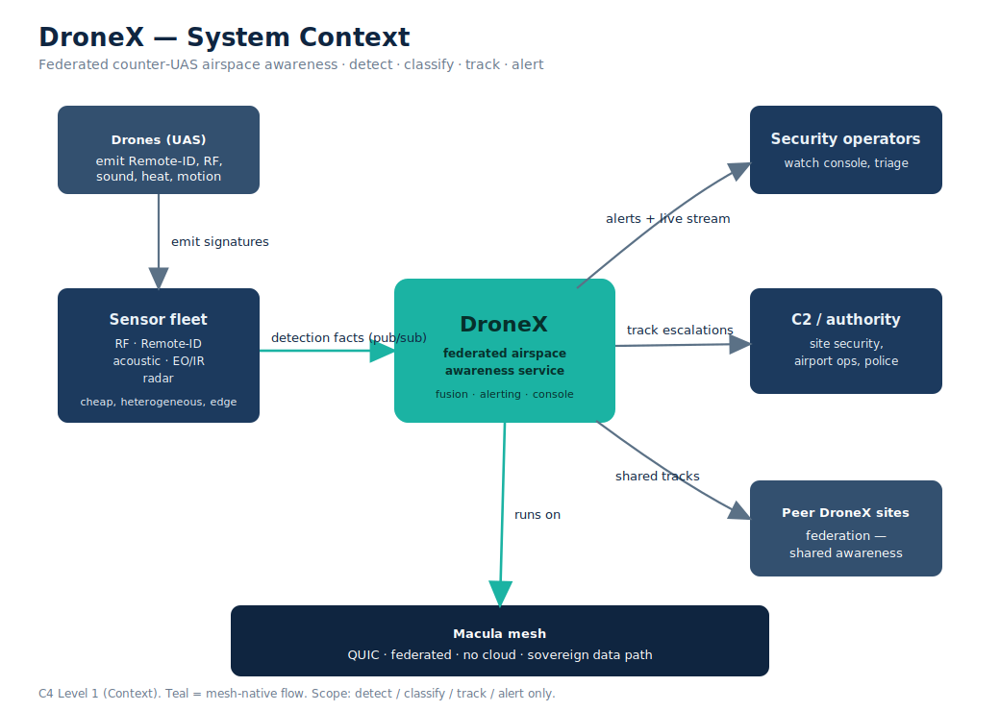
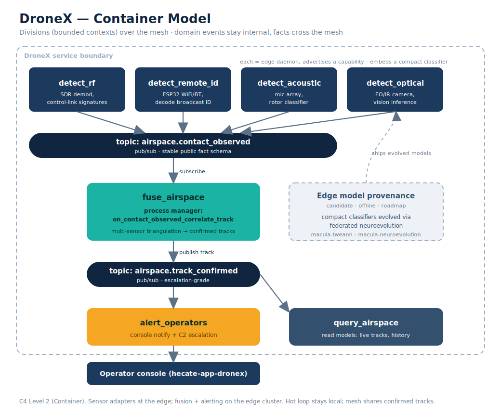
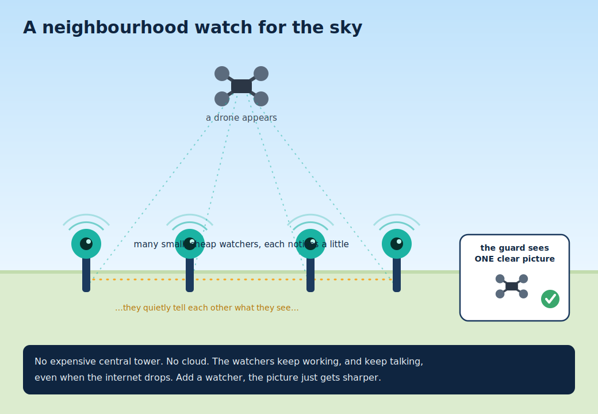
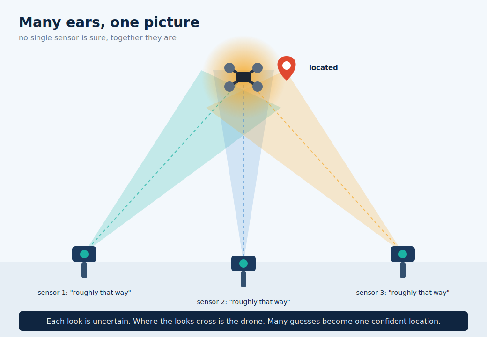

# DroneX: Drone Detection on the Macula Capability Mesh

**Status:** Draft / Concept &nbsp;·&nbsp; **Repo:** `hecate-services/hecate-dronex` &nbsp;·&nbsp; **Date:** 2026-06-09

> **Scope statement.** This document covers **defensive airspace situational
> awareness**: detect, classify, track, alert. It does not cover, propose, or
> enable interference with aircraft (jamming, spoofing, takeover, kinetic
> response). Those belong to a separate legal and ethical regime and are out
> of scope.

---

## 1. Executive summary

Drone detection is fundamentally a **distributed sensor-fusion** problem. No
single sensor type is reliable on its own, so a usable system needs many
cheap, heterogeneous sensors fused into one coherent airspace picture. That
is precisely the shape of a **capability mesh**.

Macula is a good fit, with one honest framing caveat: **Macula is the nervous
system, not the senses.** It provides federated discovery, routing, pub/sub
and streaming across a fleet of sensors. The actual detection (RF
demodulation, Remote-ID decode, acoustic ML, vision inference) is application
logic built on top. Macula does not detect drones; it lets a swarm of
detectors act as one system without a cloud and without a single point of
failure.

This aligns strongly with the strategic positioning of the wider project:
European, federated, sovereign-by-construction, public-sector and
critical-infrastructure oriented. Counter-UAS airspace awareness is an active
European procurement and grant area.

---

## 2. What drone detection actually needs

Five detection modalities, all distributed by nature:

| Modality | Sensor | What it emits |
|----------|--------|---------------|
| **RF** | SDR / protocol sniffer | control-link and telemetry signatures (e.g. DJI OcuSync, Lightbridge) |
| **Remote ID** | cheap ESP32 / WiFi+BT receiver | legally mandated drone broadcast ID (EU direct remote ID, FAA Remote ID) |
| **Acoustic** | microphone array + classifier | rotor signature, bearing |
| **Radar** | micro-Doppler module | range, velocity, track |
| **EO/IR** | camera + computer-vision model | visual confirmation, track, payload identification |

No single sensor is reliable alone. RF goes quiet on autonomous flight;
acoustic struggles in wind and noise; cameras need line of sight and good
light; radar is costly. **You need many cheap nodes fused into a track.** That
is the entire case for a federated mesh.

### The Remote-ID wedge

The cleanest entry point is **Remote ID**. Drones are legally required to
broadcast an identifier over WiFi/Bluetooth (EU direct remote identification;
FAA Remote ID). A roughly five-euro ESP32 can receive it. A mesh of cheap
Remote-ID receivers covering a perimeter becomes a distributed
airspace-awareness network at near-zero per-node cost. Macula is the glue that
makes two hundred of them behave as one system.

This gives a concrete, demonstrable, low-bill-of-materials first product with
a clear public-interest framing and an obvious funding story.

---

## 3. Architecture context (C4 Level 1)

DroneX sits between a fleet of edge sensors and the people and systems that
act on airspace events. It runs **on** the Macula mesh and federates with peer
DroneX sites.



**External actors and systems**

- **Sensor nodes** (RF, Remote-ID, acoustic, EO/IR, radar) feed detections in.
- **Drones** emit Remote-ID broadcasts and RF/acoustic/optical signatures,
  the phenomena being observed, not parties to the system.
- **Security operators** receive alerts and view the live console.
- **C2 / external authority** (site security, airport ops, police) receive
  escalations.
- **Peer DroneX sites** share confirmed-track situational awareness across the
  federation.
- **Macula mesh** is the substrate everything rides on.

---

## 4. Primitive mapping

Macula's four primitives map almost one-to-one onto a counter-UAS pipeline.

| Macula primitive | DroneX use |
|------------------|------------|
| **Pub/Sub** | Detection facts fan out. Each sensor publishes `airspace.contact_observed` (bearing, confidence, timestamp, sensor-id). Fusion, alerting and logging subscribe independently. |
| **RPC** | On-demand interrogation. "Give me your last 30s of spectrum / IQ capture / a still frame." Fusion calls a sensor only when it needs corroboration, instead of every sensor firehosing everything. |
| **Content Streaming** | Live EO/IR video, audio, or RF waterfall to an operator console when a contact escalates. |
| **Content Sharing** | Archived clips, captured IQ blobs, evidence packages, content-addressed, suitable for chain of custody. |
| **Capability advertisement** | Dynamic, heterogeneous fleet. A node announces `rf_sensor` / `remote_id_sensor` / `eo_camera`. Fusion discovers what is online without static config. |

The default carries **tiny detection facts**; raw media moves only on
escalation and only by explicit request. This keeps the hot loop cheap.

---

## 5. Container model (C4 Level 2) and DDD shape

This is a textbook fit for the Hecate process-centric architecture. Each
sensor type is a **Division** (bounded context) owning its full detection
lifecycle; a fusion division correlates facts into tracks; an alerting
division notifies operators.



### Divisions

```
detect_rf         (Division)  ─┐
detect_remote_id  (Division)  ─┤  each owns its detection lifecycle
detect_acoustic   (Division)  ─┤  events: contact_detected_v1,
detect_optical    (Division)  ─┘          contact_classified_v1,
                                          contact_lost_v1
        │  (each publishes an integration FACT to the mesh)
        ▼
   topic: airspace.contact_observed   (stable public schema)
        │
        ▼
fuse_airspace (Division)
   on_contact_observed_correlate_track   (process manager)
   → publishes airspace.track_confirmed
        │
        ▼
alert_operators (Division)
   subscribes track_confirmed → console / C2 notification
```

### Domain events vs integration facts

Detection events stay **internal** (ReckonDB domain events). What crosses the
mesh is an explicit **integration fact** with a stable public schema. A sensor
swapping its internal model must not break the fusion contract. Counter-UAS is
a clean illustration of why that boundary exists.

### Naming

Business verbs only, no CRUD: `contact_detected`, `contact_classified`,
`contact_lost`, `track_confirmed`, `track_lost`. CMD apps are named for the
process (`detect_remote_id`, `fuse_airspace`), not for data management. Query
side is `query_airspace`.

### Cross-division integration

Fusion reacts to sensor facts through a **process manager**
(`on_contact_observed_correlate_track`), never by direct dispatch. The `on_*`
directory makes the integration point scream at the filesystem level.

---

## 6. Why Macula specifically (not Kafka + a cloud)

1. **Federated, no cloud, survives contested comms.** Counter-UAS at a border,
   prison, port or airport often runs degraded or air-gapped. A centralized
   broker is a single kill point. The mesh keeps fusing locally when the
   uplink is cut.
2. **Edge-native.** Hecate daemons already run on edge devices. A sensor node
   is just a daemon advertising a capability.
3. **Sovereign data path.** No Microsoft / AWS / Azure in the chain. For
   European defence and critical-infrastructure procurement this is frequently
   a hard requirement, not a preference.
4. **Edge AI that fits the problem (and is not an LLM).** Detection is
   compact, discriminative, per-modality classification: acoustic signatures,
   RF modulation, micro-Doppler, vision. Those classifiers run **inside each
   `detect_*` slice** (the model belongs to the slice that owns the modality),
   doing inference at the edge with raw data staying local. This is not a
   language model, and there is no separate horizontal "AI service."
5. **Federated training is a natural fit (candidate: neuroevolution).** To
   produce and improve those compact classifiers, federated neuroevolution
   (`macula-tweann` / `macula-neuroevolution`, the Faber lineage) is the
   leading candidate: TWEANN evolves *small* network topologies, which is
   exactly what cheap edge nodes need, and it can run across the fleet without
   centralizing raw RF/video. Honest caveat: this is a candidate, not a
   settled choice. Conventional small supervised models are the baseline;
   pick empirically, per modality.

---

## 7. Honest gaps and mitigations

| Gap | Reality | Mitigation |
|-----|---------|------------|
| **Latency** | Cross-station wide-area routing has been a real tuning surface (advertise-settle timing, observer mailbox bottlenecks). Counter-UAS wants sub-second to seconds. | Run fusion **at the edge cluster**. Use the mesh for cross-site situational sharing, not for the hot detection loop. |
| **High-bandwidth streaming at scale** | Raw IQ and 4K EO over the streaming primitive is unproven at fleet scale. | Sensors do local DSP/inference and publish **detections** (tiny). Stream raw media only on escalation. |
| **Macula is coordination, not algorithms** | The RF demod, acoustic classifier and CV model must still be built or bought. | Treat detection algorithms as first-class engineering, not "just integration." |
| **Edge-AI method unproven** | Neuroevolution is an attractive candidate (compact, federated-friendly, on-brand) but not validated for these modalities. | Baseline with conventional small supervised models; benchmark neuroevolution per modality; choose on evidence, not aesthetics. |
| **Dual-use authorization** | Detection is defensive and legitimate; anything past awareness is a different regime. | Hard scope: detect / classify / track / alert. No jamming, spoofing, takeover, or kinetic response. |

---

## 8. Strategic note

This aligns hard with the project's positioning: European, federated,
public-sector, critical-infrastructure, sovereign by construction.
Counter-UAS airspace awareness is an active EU procurement and grant area
(airport disruptions, post-2022 border concern).

A **cheap distributed Remote-ID sensor mesh** is a concrete, demonstrable
wedge: low bill of materials, clear public-interest framing, and a fundable
open substrate (EU civic/defence programmes, Sovereign Tech Fund resubmission
once it runs in production, NLnet for the open mesh layer).

---

## 9. Non-technical explainers

For briefings to non-technical audiences (procurement, civic, public-sector),
two plain-language pictures:

### 9.1 Neighbourhood watch for the sky



Many small, cheap watchers around a site each notice a little. They quietly
tell each other what they see. One guard gets a single clear picture. No
expensive central tower; no cloud; nothing stops working when the internet
drops.

### 9.2 Many ears, one picture



No single sensor is certain where a drone is. But when several point roughly
toward the same spot, the lines cross, and the crossing point is the drone.
Many uncertain observations become one confident location.

---

## 10. Next steps

1. **Walking skeleton:** `detect_remote_id` division: capability
   advertisement + `airspace.contact_observed` fact schema + a fusion process
   manager that correlates two receivers into a single track.
2. **Hardware probe:** ESP32 Remote-ID receiver feeding a Hecate daemon.
3. **One-pager** for the procurement / grant angle, derived from §8.

---

## Appendix A: Fact schema sketch (`airspace.contact_observed`)

```
{
  "fact":        "airspace.contact_observed",
  "v":           1,
  "sensor_id":   "remote_id_sensor:perimeter-ne-03",
  "modality":    "remote_id",
  "observed_at": "2026-06-09T15:42:01.214Z",
  "bearing_deg": 47.5,          // optional, sensor dependent
  "range_m":     320,           // optional
  "position":    {"lat": ..., "lng": ...},  // if directly known (Remote ID)
  "drone":       {"id": "...", "type": "DJI Mavic 3", "operator_hint": "..."},
  "confidence":  0.82
}
```

Internal domain events (`contact_detected_v1` etc.) may carry more, and may
change shape independently. The fact above is the stable public contract.
