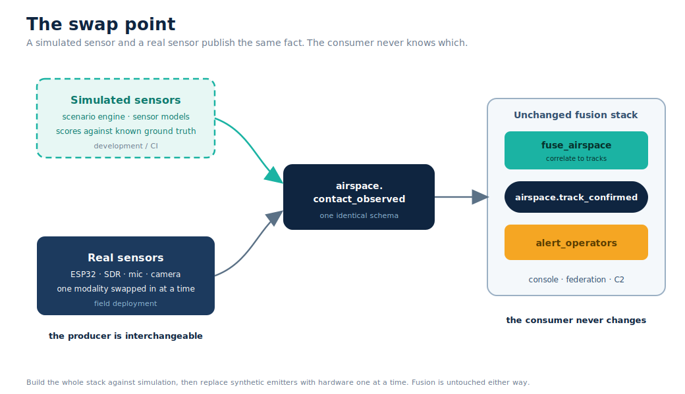
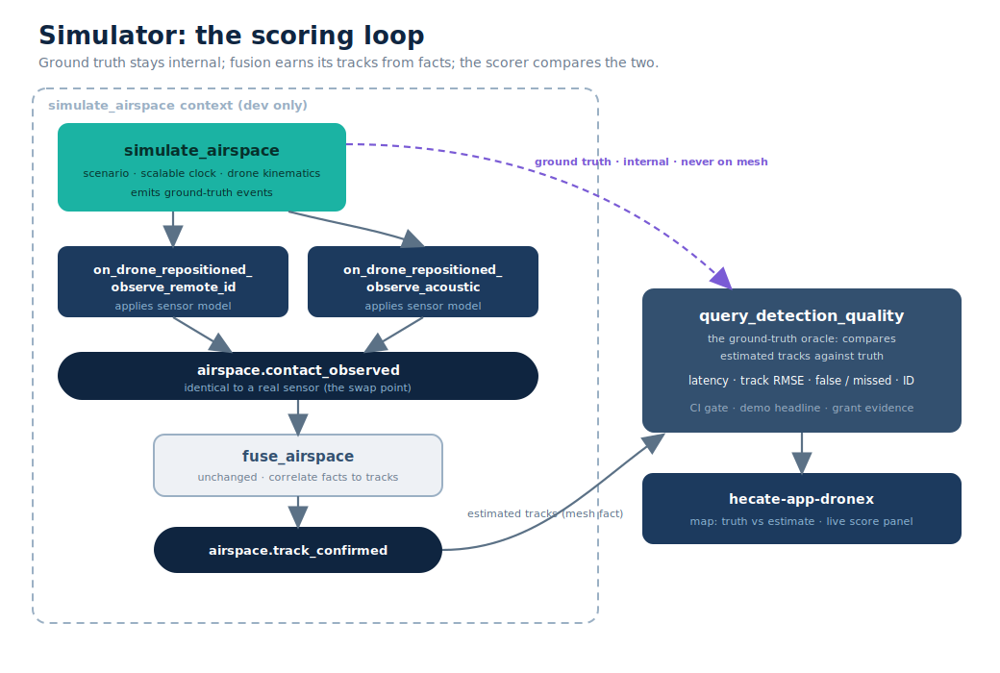

# DroneX Simulator

**Status:** Draft / Concept &nbsp;·&nbsp; **Repo:** `hecate-services/hecate-dronex` &nbsp;·&nbsp; **Date:** 2026-06-10

> Companion to [DESIGN_DRONEX_MESH.md](DESIGN_DRONEX_MESH.md). That document
> defines the system; this one defines how we simulate it so the system can be
> built and validated before, and alongside, any hardware.

---

## 1. Why simulate

A simulator is not a nice-to-have here. It is the fastest path to a working
DroneX, and it keeps working forever as a test harness. Five concrete payoffs:

1. **Build the whole stack with no hardware.** Fusion, alerting, federation,
   the console, and the scenarios can all be developed and exercised before a
   single ESP32 exists.
2. **Regression harness / CI.** Because the simulator owns ground truth, it
   can score fusion accuracy on every commit and gate releases, the same way
   the parksim end-to-end probes act as regression detectors.
3. **Reproducible scenarios.** Swarms, decoys (birds), weather, and sensor
   outages are scripted and replayable. Field incidents are impossible to
   reproduce on demand; simulated ones are not.
4. **Demonstrations and grant evidence.** A scored, visual run ("track held to
   X metres at Y false-alarm rate") is far more credible than a slide.
5. **Synthetic data for classifiers (later).** At higher fidelity, the same
   framework can generate training data and feed federated neuroevolution.

This is a shape the wider project has already shipped twice: `parksim` and
`ClankerCab` are both scenario-driven, event-sourced, multi-tenant simulations
running over the Macula mesh with a map view and scored behaviour. The DroneX
simulator is the same machine pointed at airspace.

---

## 2. The architectural unlock: the mesh boundary is the fact

The reason this is cheap to do well: a synthetic sensor and a real sensor
publish exactly one thing, `airspace.contact_observed`, with an identical
schema. Everything downstream (`fuse_airspace`, `alert_operators`, the
console, peer-site federation) cannot tell them apart and does not need to.

So the simulator is a drop-in hardware stand-in. The fusion stack runs
**unchanged** whether its inputs come from a scenario engine or from ESP32s on
a fence. Hardware is introduced one modality at a time by replacing one
synthetic emitter with one real one.



This is the screaming-architecture payoff made concrete: the contract is the
fact, the producer is interchangeable, and the consumer never changes.

---

## 3. Three fidelity layers

Simulation depth is a choice, not a fixed cost. Three layers, built in order
of value:

| Layer | What it produces | Effort | Build when |
|-------|------------------|--------|------------|
| **L1: Fact level** | `contact_observed` facts via a sensor error model | Low (reuses parksim) | First. Highest ROI. |
| **L2: Topology level** | Multiple sites as tenants, federating tracks | Low add-on | Alongside L1, to test peer-site federation |
| **L3: Signal level** | Synthetic waveforms / frames (RF, audio, IR) | High; domain-gap risk | Only when classifiers are on the critical path |

Fidelity is **pluggable**, not a rewrite between layers. The sensor model is a
behaviour:

```
%% behaviour: dronex_sensor_model
-callback observe(GroundTruth :: drone_state(), Sensor :: sensor_pose())
    -> {ok, contact_observed_fact()} | miss.
```

`remote_id_model`, `rf_model`, `acoustic_model`, `optical_model` are
implementations. L1 implementations compute a noisy fact directly from ground
truth; an L3 implementation renders a synthetic signal and runs the *real*
classifier over it. Same callback, same fact out. The fusion stack never knows
which it got.

---

## 4. Container model and DDD shape

The simulator lives **inside** `hecate-dronex` (not a separate repo), because
it is the test harness for the same divisions and shares the same fact
contracts. Synthetic-sensor apps are development-only; they are never deployed
to a production site.



### Slices

```
simulate_airspace        (CMD)   scenario + scalable clock + drone kinematics
   events: scenario_started_v1, drone_entered_airspace_v1,
           drone_repositioned_v1, decoy_appeared_v1,
           drone_departed_v1, scenario_completed_v1   (ground truth)

   on_drone_repositioned_observe_remote_id   (sibling slice / PM)
   on_drone_repositioned_observe_rf          ...
        apply the sensor model -> publish airspace.contact_observed
        >>> THE SWAP POINT: byte-identical to a real sensor's output

   ... unchanged: fuse_airspace -> airspace.track_confirmed ...

query_detection_quality  (PRJ+QRY)  subscribe ground truth (internal) +
        track_confirmed (mesh fact); compute scores
   projections: drone_repositioned_v1_to_ground_truth,
                track_confirmed_v1_to_estimates

hecate-app-dronex        (UI)    map: ground truth vs estimated tracks,
                                 sensor coverage, live score panel
```

### Why ground truth is internal, scores cross nothing

`simulate_airspace` ground-truth events are **internal domain events** of the
simulator's bounded context. The scorer consumes them locally and compares
against the `track_confirmed` **facts** it receives from the mesh. This
respects the domain-event vs integration-fact boundary: the sim does not leak
ground truth onto the mesh, so fusion cannot cheat by seeing the answer.

---

## 5. The sensor model is where the realism budget goes

A simulator that always reports the drone perfectly teaches nothing. The value
is entirely in modelling **uncertainty**, not in graphics. Each sensor model
must capture:

| Property | Why it matters |
|----------|----------------|
| **Field of view / range** | A sensor only sees its sector; coverage gaps are where drones get through. |
| **Detection probability** | Falls with range, weather, occlusion, and target size. Drives missed detections. |
| **Bearing / range error** | Gaussian (or worse) noise. Drives how well fusion can triangulate. |
| **Latency** | Time from event to published fact. Drives track lag and association errors. |
| **False-alarm rate** | Birds, ground clutter, reflections. Drives false tracks and operator fatigue. |
| **Confusion matrix** | A model that sometimes calls a Mavic a Phantom. Drives classification trust. |

Per-modality notes:

- **Remote ID:** near-perfect identity and position *when present*, but absent
  on non-compliant or autonomous craft. Model presence/absence as the dominant
  variable.
- **RF:** detects control links; goes blind on autonomous flight. Bearing-only
  unless multilaterated.
- **Acoustic:** short range, bearing-only, degrades hard with wind and ambient
  noise.
- **EO/IR:** needs line of sight and light; strong identity when it has them.

These curves and matrices are the model's parameters. They are the difference
between a toy and a test.

---

## 6. Scenarios

Scenarios are declarative and replayable. A scenario defines drones with
trajectories, clutter, environment, and sensor placement. The clock is
**scalable** (sim time can run faster or slower than wall clock, as parksim's
`time_scale` already does), so a one-hour incursion can be replayed in
seconds in CI or in real time for a demo.

```yaml
# scenario: perimeter_probe.yaml  (sketch)
clock: { time_scale: 10.0 }
environment: { wind_ms: 6, visibility: low }
sensors:
  - { id: ne-03, type: remote_id, pose: {x: 120, y: 40} }
  - { id: ne-04, type: acoustic,  pose: {x: 80,  y: 70} }
drones:
  - id: bogey-1
    type: "DJI Mavic 3"
    remote_id: present
    path: [ {t: 0, x: 0, y: 0, alt: 0}, {t: 90, x: 140, y: 60, alt: 80} ]
clutter:
  - { kind: bird_flock, count: 12, region: north }   # false-alarm source
```

---

## 7. Scoring and the ground-truth oracle

Because the simulator knows truth, every run yields hard metrics:

| Metric | Definition |
|--------|------------|
| **Detection latency** | wall/sim time from drone entering coverage to first `track_confirmed` |
| **Track positional error** | RMS distance between estimated track and ground truth over its life |
| **False-track rate** | confirmed tracks with no matching ground-truth drone, per hour |
| **Missed-detection rate** | ground-truth drones never confirmed while in coverage |
| **Association / ID accuracy** | fraction of tracks bound to the correct drone and type |

These become the **CI gate**: a commit that regresses track error or
false-track rate fails. They are also the demo headline and the grant
evidence.

---

## 8. Topology and multi-site simulation (L2)

Run several sites as tenants on beam00-03 (for example airport, prison, port),
each a `simulate_airspace` instance with its own sensors and fusion, all
federating `airspace.track_confirmed` across the mesh. This exercises the
"Peer DroneX sites" element of the system context directly, using the same
multi-tenant deploy pattern `parksim` and `ClankerCab` already run (one tenant
per node, gateway-federated). It is a small add-on over L1, not a new build.

---

## 9. Signal-level simulation (L3, optional, heavy)

To train and evaluate the actual edge classifiers (and to feed federated
neuroevolution, `macula-tweann` / `macula-neuroevolution`), the same framework
can generate synthetic signals: RF spectra (for example via GNU Radio),
room/field acoustics, and EO/IR frames (AirSim, Blender). An L3 sensor model
renders a signal from ground truth and runs the real classifier over it, so
the classifier itself is under test, not bypassed.

Honest caveats:

- **Domain gap.** Synthetic signals are not real signals; classifiers trained
  only on synthetic data tend to fail on real captures. Treat L3 data as
  augmentation and pre-training, validated against real captures.
- **Effort.** This is a separate, substantial project integrating external DSP
  and rendering tooling, not an afternoon. Defer until L1/L2 prove the
  coordination layer and classifiers are genuinely on the critical path.

---

## 10. Reuse from existing simulators

| Need | Borrow from |
|------|-------------|
| Scenario engine + scalable clock | `parksim` (time_scale, scenario lifecycle) |
| Multi-tenant cluster deploy | `parksim` / `ClankerCab` deploy + clean scripts |
| Map view, inline SVG, moving agents | `ClankerCab` (grid city, inline-SVG map) |
| Event-sourced sim lifecycle | both (initiated/active/.../archived patterns) |
| Mesh primitives | `macula` (publish facts, federate) |

The first build should **mine parksim** for its scenario/clock/deploy
machinery rather than reinvent it.

---

## 11. What the simulator is not

- **Not a flight simulator.** Drone kinematics are as simple as the scoring
  needs; we model where a drone is, not how it flies.
- **Not an RF-propagation engine at L1.** Fact-level sensor models encode
  detection *outcomes* (probability, noise), not Maxwell's equations.
- **Not allowed to leak ground truth onto the mesh.** Fusion must earn its
  tracks from facts alone.
- **Not a graphics project.** The realism budget goes to uncertainty models
  and scoring, not rendering.

These boundaries keep L1 cheap and honest.

---

## 12. Build order

1. **Walking-skeleton sim:** one scenario, one `remote_id` sensor model,
   `simulate_airspace` publishing `contact_observed` into the existing fusion
   stack, scored against ground truth. End to end, single node.
2. **Second modality** (`acoustic`) to make fusion do real triangulation, plus
   a clutter source to exercise false-alarm handling.
3. **Scoring read model + console panel** (`query_detection_quality`, map view).
4. **CI gate** on track error and false-track rate.
5. **L2 multi-site** on beam00-03 for federation.
6. **L3** only if and when classifiers need synthetic data.

---

## Appendix A: `dronex_sensor_model` behaviour (sketch)

```erlang
-module(dronex_sensor_model).
%% A sensor model turns ground truth into what THIS sensor would report.
%% L1 implementations compute a noisy fact; L3 implementations render a
%% signal and run the real classifier. Same callback, same fact out.

-callback observe(GroundTruth :: drone_state(), Sensor :: sensor_pose())
    -> {ok, Fact :: map()} | miss.

%% Fact is exactly an airspace.contact_observed payload, identical to what a
%% real sensor publishes. The rest of DroneX cannot tell sim from hardware.
```

## Appendix B: detection-quality scoring (sketch)

```
score(GroundTruthTracks, ConfirmedTracks) -> #{
    detect_latency_ms   => ...,   % per drone, entry-to-first-confirm
    track_rmse_m        => ...,   % estimate vs truth over track life
    false_tracks_per_hr => ...,   % confirmed with no truth match
    missed_rate         => ...,   % truth in coverage, never confirmed
    id_accuracy         => ...    % correct drone + type binding
}.
```
